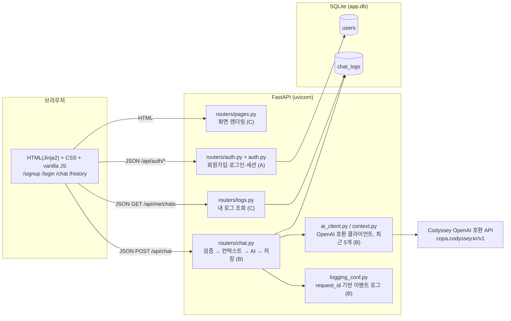
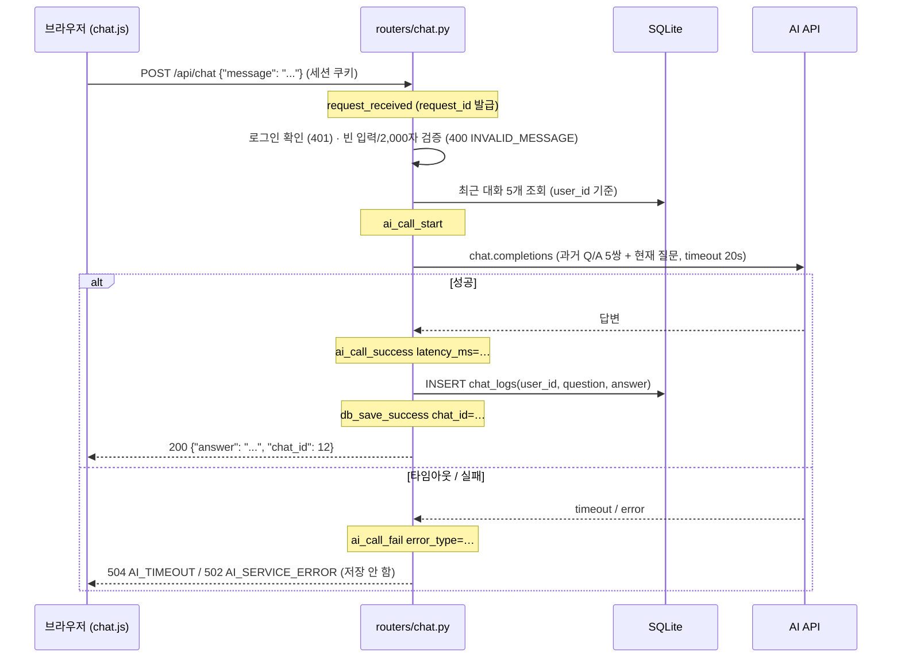
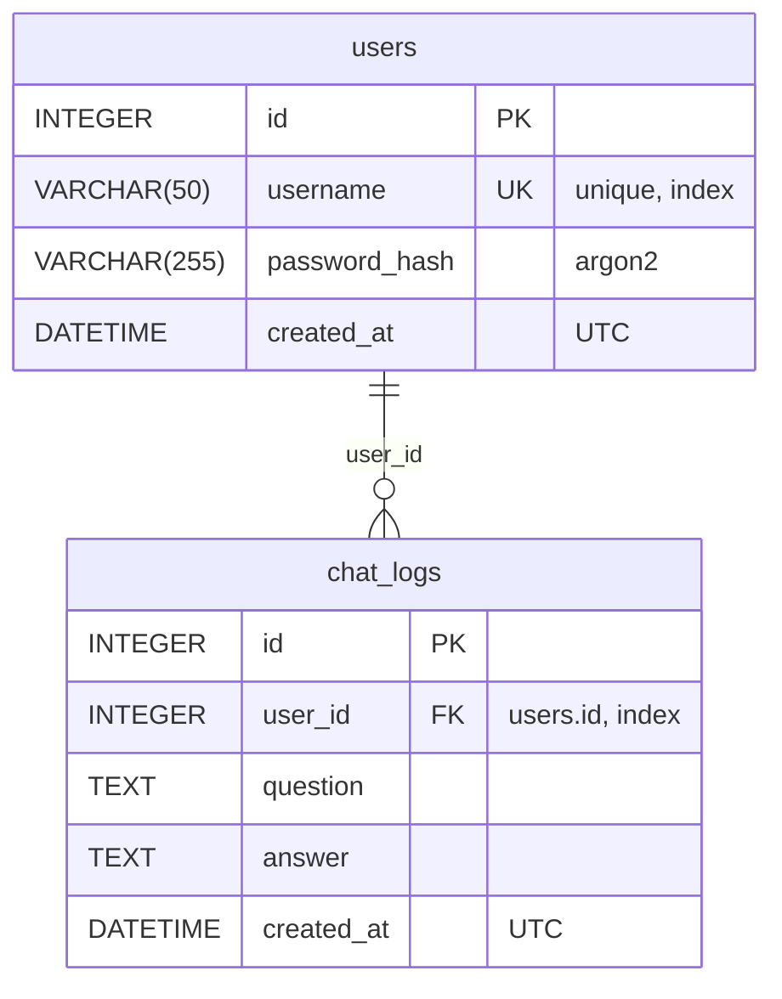

# Codyssey AI Chatbot

로그인한 사용자가 웹 화면에서 질문을 입력하면 서버가 AI API 를 호출해 답변을 돌려주고, 모든 대화를 DB 에 누적 저장해 사용자별로 조회할 수 있는 **웹 기반 AI 챗봇 서비스**입니다. Codyssey AI/SW 기초 과정 텀 프로젝트(3인 팀)로 FastAPI + SQLite 로 구현했습니다.

- **배포 URL**: _(Render 배포 후 여기에 적습니다. 예: `https://codyssey-ai-chatbot.onrender.com`)_
- **저장소**: https://github.com/Codyssey-AI-Chatbot/Codyssey-AI-Chatbot
- **기술 스택**: Python 3.10, FastAPI, SQLAlchemy 2, SQLite, Jinja2, OpenAI Python SDK(OpenAI 호환 API), pytest

## 목차

1. [프로젝트 개요](#1-프로젝트-개요)
2. [시스템 구조](#2-시스템-구조)
3. [API 명세](#3-api-명세)
4. [DB 구조](#4-db-구조)
5. [실행 방법 (로컬)](#5-실행-방법-로컬)
6. [배포 방법 (Render)](#6-배포-방법-render)
7. [환경 변수](#7-환경-변수)
8. [민감정보 관리](#8-민감정보-관리)
9. [운영: 로그, 예외 처리, 입력 검증](#9-운영-로그-예외-처리-입력-검증)
10. [DB 확인 가이드](#10-db-확인-가이드)
11. [팀 구성원 역할 및 개인별 작업 요약](#11-팀-구성원-역할-및-개인별-작업-요약)
12. [협업 규칙](#12-협업-규칙)
13. [테스트](#13-테스트)

---

## 1. 프로젝트 개요

### 문제 정의

리눅스 환경 구성, 웹 개발, 데이터베이스, AI API 연동은 각각 배웠지만 따로 떨어져 있으면 서비스가 되지 않습니다. 이 프로젝트는 네 가지를 **하나의 흐름**으로 연결합니다. 사용자의 질문이 브라우저에서 서버로 들어와 AI API 를 거쳐 답변으로 돌아오고, 그 기록이 DB 에 남아 다시 조회되는 전체 파이프라인을 팀 단위로 기획부터 배포까지 완성하는 것이 목표입니다.

### 타겟 사용자

| 사용자 | 하는 일 |
|---|---|
| 일반 사용자 | 회원가입·로그인 후 채팅 화면에서 질문하고 답변을 받는다. 자신의 대화 기록을 다시 본다. |
| 운영자 / 평가자 | 서버 로그로 요청 처리 과정을 추적하고, DB 에 쌓인 대화 로그를 API·화면·SQL 로 확인한다. |

### 핵심 시나리오

1. **가입과 로그인**: `/signup` 에서 가입 → `/login` 에서 로그인 → 세션 쿠키가 발급되어 `/chat` 으로 이동한다. 로그인하지 않으면 `/chat`, `/history` 는 `/login` 으로 보내고, `POST /api/chat` 은 `401` 을 돌려준다.
2. **질문과 답변**: 채팅 화면에서 질문을 보내면 서버가 AI API 를 호출하고, 답변이 같은 화면에 말풍선으로 추가된다. 서버는 질문·답변을 `chat_logs` 에 저장한다.
3. **문맥 유지**: 서버는 같은 사용자의 **최근 5개 대화**를 함께 AI 에 전달한다. "내가 방금 뭘 물어봤지?" 같은 질문에 이어서 답할 수 있다.
4. **실패 안내**: AI 가 20초 안에 답하지 않거나 오류를 내면 서비스는 죽지 않고 `AI_TIMEOUT` / `AI_SERVICE_ERROR` 안내를 화면에 보여 준다. 실패한 대화는 저장하지 않는다.
5. **기록 조회와 확인**: 사용자는 `/history` 화면과 `GET /api/me/chats` 로 자신의 로그만 본다. 운영자는 `scripts/check_logs.sql` 로 DB 를 직접 확인한다.

### 과제 요구사항 대응표

| # | 요구사항 | 구현 | 담당 |
|---|---|---|---|
| 1 | 웹 UI (질문 입력, 같은 화면에서 응답 확인) | `/chat` 페이지 + `chat.js` (fetch 로 호출, 말풍선 추가) | C |
| 2 | 사용자 인증 및 접근 제어 | 회원가입/로그인/로그아웃 API, 세션 쿠키, `get_current_user`(401) / `get_current_user_or_redirect`(303) | A |
| 3 | AI 챗봇 처리 (서버에서 AI 호출, 컨텍스트 전략) | `ai_client.py`(OpenAI 호환 API, 타임아웃), `context.py`(최근 5개) | B |
| 4 | 대화 로그 저장 및 조회/추적 | `ChatLog(user_id, question, answer, created_at)` 저장(B), `GET /api/me/chats`·`/history`·SQL(C) | A·B·C |
| 5 | 운영 및 유지보수 (로그/예외/입력 검증) | `request_received` → `ai_call_*` → `db_save_*` 로그, 에러 코드 응답, 빈 입력·2,000자 제한 | B |
| 6 | 배포 및 접근성 | Render Blueprint(`render.yaml`), 이 문서의 배포/환경 변수 절 | C |
| 7 | 협업 및 형상관리 | `main`/`develop`/`feature/*`, PR 템플릿, 이슈 연결, 팀원별 10회 이상 커밋 | 전원 |

---

## 2. 시스템 구조

### 아키텍처



AI API 키는 서버의 환경 변수에만 있고, 브라우저는 `/api/chat` 의 결과 텍스트만 받습니다.

### 채팅 요청 처리 흐름



### 주요 컴포넌트

| 경로 | 역할 | 담당 |
|---|---|---|
| `app/main.py` | FastAPI 앱 생성, 세션 미들웨어, 정적 파일, 라우터 등록, 시작 시 테이블 생성, `/health` | A |
| `app/config.py` | `.env` 와 환경 변수를 한 곳에서 읽는 `Settings` | A |
| `app/db.py` | SQLAlchemy 엔진·세션, SQLite 외래키 활성화, 요청당 세션을 주는 `get_db` | A |
| `app/models.py` | `User`, `ChatLog` 테이블 정의 | A |
| `app/auth.py` | argon2 비밀번호 해싱, `AuthError`, 로그인 확인 의존성 2종 | A |
| `app/routers/auth.py` | `POST /api/auth/signup`, `/login`, `/logout`, `GET /api/auth/me` | A |
| `app/ai_client.py` | 공급자 독립 `AIClient` 인터페이스와 OpenAI 호환 구현, 타임아웃·오류 변환 | B |
| `app/context.py` | 사용자의 최근 N개(기본 5) 대화를 시간순 메시지로 구성 | B |
| `app/routers/chat.py` | `POST /api/chat`: 검증 → 컨텍스트 → AI 호출 → 저장, 단계별 로그와 에러 코드 응답 | B |
| `app/logging_conf.py` | 민감정보를 제외한 `key=value` 이벤트 로그 (`app.chat` 로거) | B |
| `app/errors.py` | `AITimeoutError`, `AIServiceError` | B |
| `app/routers/pages.py` | `/`, `/signup`, `/login`, `/chat`, `/history` 템플릿 렌더링 | C |
| `app/routers/logs.py` | `GET /api/me/chats` 내 로그 조회 | C |
| `app/templates/`, `app/static/` | Jinja2 템플릿, CSS, `auth.js`(폼 전송), `chat.js`(채팅) | C |
| `scripts/check_logs.sql`, `scripts/check_logs.py` | DB 확인용 SQL 과 실행기 | C |
| `render.yaml` | Render 배포 설정 | C |
| `tests/` | `conftest.py`(A), `test_auth.py`(A), `test_chat.py`(B), `test_pages.py`·`test_logs.py`(C) | 전원 |

### 디렉터리 구조

```text
.
├── app/
│   ├── main.py            # 앱 생성, 미들웨어, 라우터 등록
│   ├── config.py          # 환경 변수
│   ├── db.py              # 엔진, 세션, Base
│   ├── models.py          # users, chat_logs
│   ├── auth.py            # 해싱, 인증 의존성
│   ├── ai_client.py       # AI 클라이언트
│   ├── context.py         # 대화 컨텍스트
│   ├── errors.py          # AI 예외
│   ├── logging_conf.py    # 이벤트 로그
│   ├── routers/
│   │   ├── auth.py        # /api/auth/*
│   │   ├── chat.py        # /api/chat
│   │   ├── logs.py        # /api/me/chats
│   │   └── pages.py       # 화면
│   ├── templates/         # base, signup, login, chat, history
│   └── static/            # style.css, auth.js, chat.js
├── scripts/
│   ├── check_logs.sql     # DB 확인용 SQL
│   └── check_logs.py      # SQL 실행기 (sqlite3 CLI 없는 환경)
├── tests/
├── docs/team-roles.md     # 역할 분담과 협업 규칙
├── .github/pull_request_template.md
├── .env.example           # 환경 변수 예시 (실제 값 없음)
├── render.yaml            # Render 배포 설정
├── requirements.txt
└── pytest.ini
```

---

## 3. API 명세

모든 API 는 JSON 을 주고받습니다. 로그인 상태는 서명된 세션 쿠키(`HttpOnly`, `SameSite=Lax`)로 유지되며, 브라우저의 `fetch` 는 같은 출처라 쿠키를 자동으로 보냅니다. 실행 중인 서버에서는 `/docs` (Swagger UI) 로도 확인할 수 있습니다.

### 엔드포인트 목록

| 구분 | 메서드·경로 | 로그인 | 설명 |
|---|---|---|---|
| 인증 | `POST /api/auth/signup` | 불필요 | 회원가입 |
| 인증 | `POST /api/auth/login` | 불필요 | 로그인, 세션 쿠키 발급 |
| 인증 | `POST /api/auth/logout` | 불필요 | 세션 삭제 |
| 인증 | `GET /api/auth/me` | 필요 | 내 정보 |
| 채팅 | `POST /api/chat` | 필요 | 질문 → AI 답변, 대화 저장 |
| 로그 | `GET /api/me/chats` | 필요 | 내 대화 로그 조회 (최신순) |
| 화면 | `GET /` | - | `/chat` 으로 리다이렉트 |
| 화면 | `GET /signup`, `GET /login` | 불필요 | 가입·로그인 페이지 |
| 화면 | `GET /chat`, `GET /history` | 필요 | 채팅, 내 대화 기록 (비로그인 시 `303 → /login`) |
| 운영 | `GET /health` | 불필요 | `{"status": "ok"}` |

### 오류 응답 형식

실패 시 모든 API 는 같은 모양으로 답합니다.

```json
{ "error": "AI_TIMEOUT", "message": "AI 응답이 지연되고 있습니다. 잠시 후 다시 시도해 주세요." }
```

| HTTP | `error` | 언제 |
|---|---|---|
| 400 | `INVALID_USERNAME` | 아이디가 영문·숫자·밑줄 3~30자가 아님 |
| 400 | `INVALID_PASSWORD` | 비밀번호가 8~128자가 아님 |
| 409 | `USERNAME_TAKEN` | 이미 있는 아이디 |
| 401 | `INVALID_CREDENTIALS` | 아이디 또는 비밀번호 불일치 (어느 쪽인지 알려주지 않음) |
| 401 | `UNAUTHORIZED` | 로그인이 필요한 API 를 비로그인으로 호출 |
| 400 | `INVALID_MESSAGE` | 빈 메시지 또는 2,000자 초과 |
| 504 | `AI_TIMEOUT` | AI API 가 `AI_TIMEOUT_SECONDS`(기본 20초) 안에 응답하지 않음 |
| 502 | `AI_SERVICE_ERROR` | AI API 연결 실패, 오류 상태 코드, 빈 응답 |
| 500 | `DB_SAVE_ERROR` | 답변은 받았지만 DB 저장 실패 (롤백 후 응답) |
| 422 | (FastAPI 기본) | 요청 본문/쿼리 형식 오류 (예: `limit=0`) |

### 요청·응답 예시

아래 예시는 로컬 서버(`http://127.0.0.1:8000`) 기준이며, `-c`/`-b cookies.txt` 로 세션 쿠키를 저장·전송합니다.

**회원가입**

```bash
curl -X POST http://127.0.0.1:8000/api/auth/signup \
  -H "Content-Type: application/json" \
  -d '{"username": "alice", "password": "correct-horse"}'
```

```json
HTTP 201
{ "id": 1, "username": "alice" }
```

**로그인** (응답 헤더에 `Set-Cookie: session=...`)

```bash
curl -c cookies.txt -X POST http://127.0.0.1:8000/api/auth/login \
  -H "Content-Type: application/json" \
  -d '{"username": "alice", "password": "correct-horse"}'
```

```json
HTTP 200
{ "id": 1, "username": "alice" }
```

**내 정보 / 로그아웃**

```bash
curl -b cookies.txt http://127.0.0.1:8000/api/auth/me          # {"id": 1, "username": "alice"}
curl -b cookies.txt -X POST http://127.0.0.1:8000/api/auth/logout   # {"status": "ok"}
```

**채팅** — 요청 `{"message": "..."}`, 성공 `{"answer": "...", "chat_id": n}`

```bash
curl -b cookies.txt -X POST http://127.0.0.1:8000/api/chat \
  -H "Content-Type: application/json" \
  -d '{"message": "FastAPI에서 세션 로그인은 어떻게 구현해?"}'
```

```json
HTTP 200
{ "answer": "FastAPI 자체에는 세션 기능이 없어서 Starlette 의 SessionMiddleware 를 ...", "chat_id": 12 }
```

실패 예시:

```json
HTTP 401  { "error": "UNAUTHORIZED",     "message": "로그인이 필요합니다." }
HTTP 400  { "error": "INVALID_MESSAGE",  "message": "메시지를 입력해 주세요." }
HTTP 504  { "error": "AI_TIMEOUT",       "message": "AI 응답이 지연되고 있습니다. 잠시 후 다시 시도해 주세요." }
HTTP 502  { "error": "AI_SERVICE_ERROR", "message": "AI 서비스에 일시적인 문제가 발생했습니다. 잠시 후 다시 시도해 주세요." }
```

**내 대화 로그 조회** — `limit`(1~100, 기본 20), `offset`(기본 0), 최신순. 다른 사용자의 로그는 조회되지 않습니다.

```bash
curl -b cookies.txt "http://127.0.0.1:8000/api/me/chats?limit=2&offset=0"
```

```json
HTTP 200
[
  {
    "id": 12,
    "question": "FastAPI에서 세션 로그인은 어떻게 구현해?",
    "answer": "FastAPI 자체에는 세션 기능이 없어서 ...",
    "created_at": "2026-10-08T07:14:33.611701+00:00"
  },
  {
    "id": 11,
    "question": "배포 방법을 알려줘",
    "answer": "Render 에 GitHub 저장소를 연결하면 ...",
    "created_at": "2026-10-08T07:10:02.120445+00:00"
  }
]
```

`created_at` 은 UTC 입니다. 화면(`/history`)에서는 한국 시각(KST, +9시간)으로 보여 줍니다.

---

## 4. DB 구조

SQLite 파일 하나(`app.db`, 경로는 `DATABASE_URL`)를 사용하며, 테이블은 앱 시작 시 `Base.metadata.create_all` 로 자동 생성됩니다.

### ERD



### 테이블 설명

**`users`** — 가입한 사용자

| 필드 | 타입 | 설명 |
|---|---|---|
| `id` | INTEGER PK | 사용자 식별자. 세션 쿠키에는 이 값만 저장된다. |
| `username` | VARCHAR(50), UNIQUE, INDEX | 로그인 아이디 (영문·숫자·밑줄 3~30자) |
| `password_hash` | VARCHAR(255) | argon2 해시. 평문 비밀번호는 저장하지 않는다. |
| `created_at` | DATETIME | 가입 시각 (UTC) |

**`chat_logs`** — 성공한 대화 1건 = 1행 (과제의 최소 추적 필드: 사용자 식별, 생성 시각, 질문, 응답)

| 필드 | 타입 | 설명 |
|---|---|---|
| `id` | INTEGER PK | 대화 식별자. `POST /api/chat` 응답의 `chat_id` |
| `user_id` | INTEGER FK → users.id, INDEX | 누구의 대화인지. 사용자 기준 조회와 컨텍스트 구성의 기준 |
| `question` | TEXT | 사용자 질문 원문 |
| `answer` | TEXT | AI 답변 원문 |
| `created_at` | DATETIME | 생성 시각 (UTC). 최신순 정렬 기준 |

### 설계 메모

- **사용자 기준 조회**: `user_id` 에 인덱스를 두고, 모든 조회(`/api/me/chats`, `/history`, 컨텍스트 구성)는 `WHERE user_id = 로그인 사용자` 로만 읽습니다. 다른 사용자의 로그가 섞일 수 없습니다.
- **실패는 저장하지 않음**: AI 호출이 실패하면 `chat_logs` 에 행을 만들지 않습니다. 실패 원인은 서버 로그(`ai_call_fail`)로 추적합니다.
- **외래키**: SQLite 는 기본적으로 외래키를 검사하지 않으므로 연결마다 `PRAGMA foreign_keys=ON` 을 켭니다 (`app/db.py`).
- **시각**: 저장은 UTC 로 통일하고, 표시할 때만 KST 로 바꿉니다. SQLite 는 시간대를 저장하지 않으므로 읽을 때 UTC 를 다시 붙입니다 (`app/routers/logs.py` 의 `as_utc`).

---

## 5. 실행 방법 (로컬)

사전 준비: Python 3.10 이상, Git, Codyssey 에서 발급받은 AI API 키.

```bash
git clone https://github.com/Codyssey-AI-Chatbot/Codyssey-AI-Chatbot.git
cd Codyssey-AI-Chatbot

python -m venv .venv
source .venv/bin/activate            # Windows PowerShell: .\.venv\Scripts\Activate.ps1
pip install -r requirements.txt

cp .env.example .env                 # Windows PowerShell: Copy-Item .env.example .env
```

`.env` 를 열어 두 값을 채웁니다. 나머지는 기본값으로 동작합니다.

```bash
# SECRET_KEY 생성 (출력된 값을 .env 의 SECRET_KEY= 에 붙여 넣기)
python -c "import secrets; print(secrets.token_urlsafe(32))"
```

```dotenv
SECRET_KEY=<위에서 생성한 값>
AI_API_KEY=<발급받은 키>
```

서버 실행:

```bash
uvicorn app.main:app --reload
```

- 브라우저에서 `http://127.0.0.1:8000` 을 열면 로그인 페이지로 이동합니다. 회원가입 → 로그인 → 채팅 순서로 사용합니다.
- 첫 실행 때 저장소 루트에 `app.db` 가 만들어지고 `users`, `chat_logs` 테이블이 생성됩니다.
- API 문서(Swagger UI): `http://127.0.0.1:8000/docs`

테스트:

```bash
python -m pytest -q        # 44 passed
```

테스트는 임시 디렉터리의 별도 SQLite 파일과 가짜 AI 클라이언트를 사용하므로, 내 `.env`, `app.db`, 실제 AI API 에 영향을 주지 않습니다.

---

## 6. 배포 방법 (Render)

배포 흐름: `develop` → `main` 릴리스 PR 머지 → Render 가 `main` 을 빌드·배포. 설정은 저장소의 [`render.yaml`](render.yaml) 한 파일에 있습니다.

### 처음 배포

1. [Render](https://render.com) 에 가입하고 GitHub 계정을 연결합니다. 조직 저장소라면 Render GitHub App 에 `Codyssey-AI-Chatbot` 조직 접근을 허용합니다.
2. Dashboard → **New** → **Blueprint** → 이 저장소 선택. Render 가 `render.yaml` 을 읽어 웹 서비스 1개를 제안합니다.
3. `AI_API_KEY` 입력란이 나타나면 발급받은 키를 넣습니다. (`sync: false` 로 선언되어 저장소에는 없고 Render 에만 저장됩니다.) `SECRET_KEY` 는 Render 가 임의 값으로 생성합니다.
4. **Apply** 를 누르면 빌드(`pip install -r requirements.txt`) → 기동(`uvicorn app.main:app --host 0.0.0.0 --port $PORT`) → 헬스체크(`/health`) 순서로 진행됩니다.
5. 배포가 끝나면 `https://<서비스이름>.onrender.com/health` 가 `{"status":"ok"}` 를 돌려줍니다. 이 URL 을 이 문서 맨 위 **배포 URL** 에 적습니다.

이후에는 `main` 에 커밋이 추가될 때마다 자동으로 재배포됩니다.

### `render.yaml` 요약

| 항목 | 값 | 비고 |
|---|---|---|
| `runtime` / `plan` / `region` | python / free / singapore | 한국에서 가장 가까운 리전 |
| `branch` | `main` | 배포 브랜치. `develop` 은 배포하지 않음 |
| `buildCommand` | `pip install -r requirements.txt` | |
| `startCommand` | `uvicorn app.main:app --host 0.0.0.0 --port $PORT` | `PORT` 는 Render 가 주입 |
| `healthCheckPath` | `/health` | 실패하면 배포를 롤백 |
| `PYTHON_VERSION` | `3.10.11` | 로컬 개발·테스트와 동일 |
| `SECRET_KEY` | `generateValue: true` | Render 가 생성 |
| `AI_API_KEY` | `sync: false` | Apply 때 직접 입력 |
| `SESSION_COOKIE_SECURE` | `"true"` | Render 는 HTTPS 이므로 Secure 쿠키 |
| 그 외 `AI_*`, `DATABASE_URL` | `.env.example` 과 동일 | |

### 주의사항

- **무료 플랜은 15분 동안 요청이 없으면 잠듭니다.** 첫 요청이 30초~1분 걸릴 수 있으니 평가 직전에 한 번 접속해 깨워 두세요.
- **무료 플랜의 디스크는 재배포 때 초기화됩니다.** SQLite 파일(`app.db`)도 함께 사라지므로 재배포 뒤에는 다시 가입해야 합니다. 데이터를 유지하려면 유료 플랜에서 Persistent Disk 를 붙이고 `DATABASE_URL` 을 `sqlite:////var/data/app.db` 처럼 디스크 경로로 바꿉니다.
- `SESSION_COOKIE_SECURE=true` 는 HTTPS 전용입니다. HTTP 로만 서비스하는 환경(예: 공인 IP 의 리눅스 서버)에서는 `false` 로 두어야 로그인이 됩니다.

### 대안: 리눅스 서버에서 직접 실행

Render 대신 리눅스 서버(VM, EC2 등)를 쓴다면 5절의 설치 명령을 그대로 수행한 뒤 systemd 서비스로 등록합니다.

```ini
# /etc/systemd/system/chatbot.service
[Unit]
Description=Codyssey AI Chatbot
After=network.target

[Service]
User=ubuntu
WorkingDirectory=/home/ubuntu/Codyssey-AI-Chatbot
EnvironmentFile=/home/ubuntu/Codyssey-AI-Chatbot/.env
ExecStart=/home/ubuntu/Codyssey-AI-Chatbot/.venv/bin/uvicorn app.main:app --host 0.0.0.0 --port 8000
Restart=on-failure

[Install]
WantedBy=multi-user.target
```

```bash
sudo systemctl daemon-reload
sudo systemctl enable --now chatbot
sudo systemctl status chatbot          # 로그: journalctl -u chatbot -f
```

방화벽/보안 그룹에서 8000 포트를 열고 `http://<공인IP>:8000` 으로 접속합니다. (HTTPS 가 아니므로 `.env` 의 `SESSION_COOKIE_SECURE` 는 `false`)

---

## 7. 환경 변수

모든 설정은 `app/config.py` 의 `Settings` 가 환경 변수 → `.env` 순서로 읽습니다. 값은 `.env.example` 을 복사해 채웁니다. **실제 값은 절대 커밋하지 않습니다.**

| 변수 | 필수 | 기본값 | 설명 |
|---|---|---|---|
| `SECRET_KEY` | **예** | 없음 (없으면 시작 실패) | 세션 쿠키 서명 키. `python -c "import secrets; print(secrets.token_urlsafe(32))"` 로 생성 |
| `AI_API_KEY` | 채팅에 필요 | 없음 | AI API 키. 없으면 인증·화면은 동작하지만 `POST /api/chat` 은 실패 |
| `AI_BASE_URL` | 아니오 | `https://copa.codyssey.kr/v1` | OpenAI 호환 API 주소 |
| `AI_MODEL` | 아니오 | `gpt-5.4` | 모델 이름 |
| `AI_TIMEOUT_SECONDS` | 아니오 | `20` | AI 호출 제한 시간(초). 초과 시 `504 AI_TIMEOUT` |
| `DATABASE_URL` | 아니오 | `sqlite:///./app.db` | SQLAlchemy DB URL |
| `SESSION_MAX_AGE_SECONDS` | 아니오 | `86400` (1일) | 세션 쿠키 수명 |
| `SESSION_COOKIE_SECURE` | 아니오 | `false` | HTTPS 환경에서만 `true`. HTTP 에서 `true` 면 로그인 불가 |

Render 전용: `PYTHON_VERSION`(런타임 버전), `PORT`(Render 가 주입, 시작 명령에서 사용).

---

## 8. 민감정보 관리

- **코드와 문서에 비밀 값이 없습니다.** API 키, 비밀번호, 세션 키는 모두 환경 변수(`.env`)로만 다룹니다. 저장소에는 값이 비어 있는 [`.env.example`](.env.example) 만 있습니다.
- **`.gitignore`** 가 `.env`, `.env.*`(단 `.env.example` 은 허용), `*.db` 를 제외해 비밀 값과 로컬 DB 가 커밋되지 않습니다.
- **AI API 키는 서버에만 있습니다.** 브라우저는 `/api/chat` 의 답변 텍스트만 받고, 키나 AI API 주소를 전혀 알 수 없습니다.
- **비밀번호는 argon2 해시로만 저장**하고, 로그인 실패 시 아이디 존재 여부를 응답 문구나 응답 시간으로 드러내지 않습니다.
- **세션 쿠키**는 서명되어 위조할 수 없고 `HttpOnly`, `SameSite=Lax`, HTTPS 에서는 `Secure` 로 발급됩니다.
- **서버 로그에는 질문·답변 전문, API 키, 쿠키를 남기지 않습니다.** `request_id`, `user_id`, 이벤트 이름, 지연 시간, 오류 타입만 기록합니다.
- PR 템플릿 체크리스트에 "비밀 값이 코드·문서에 없다" 항목을 두어 리뷰 때마다 확인합니다.

---

## 9. 운영: 로그, 예외 처리, 입력 검증

### 서버 로그 이벤트

`POST /api/chat` 요청 하나는 `request_id` 하나로 묶여 다음 이벤트를 남깁니다 (`app.chat` 로거, INFO).

```text
INFO request_received request_id=3f2a9c1e5b7d4e0f8a6b2c4d9e1f0a7b user_id=1 path=/api/chat
INFO ai_call_start request_id=3f2a9c1e5b7d4e0f8a6b2c4d9e1f0a7b user_id=1
INFO ai_call_success request_id=3f2a9c1e5b7d4e0f8a6b2c4d9e1f0a7b user_id=1 latency_ms=1240
INFO db_save_success request_id=3f2a9c1e5b7d4e0f8a6b2c4d9e1f0a7b user_id=1 chat_id=12
```

실패했을 때:

```text
INFO ai_call_fail request_id=... user_id=1 error_type=AITimeoutError      # AI 타임아웃 → 504
INFO ai_call_fail request_id=... user_id=1 error_type=AIServiceError      # AI 오류 → 502
INFO db_save_fail request_id=... user_id=1 error_type=OperationalError    # DB 저장 실패 → 500 (롤백)
```

| 이벤트 | 의미 |
|---|---|
| `request_received` | 질문 수신 |
| `ai_call_start` | AI API 호출 시작 |
| `ai_call_success` / `ai_call_fail` | AI 응답 수신 (지연 시간) / 실패 (오류 타입) |
| `db_save_success` / `db_save_fail` | 대화 로그 저장 성공 (`chat_id`) / 실패 |

로그는 로컬에서는 `uvicorn` 콘솔에, Render 에서는 서비스의 **Logs** 탭에 보입니다. uvicorn 의 접근 로그(`"POST /api/chat HTTP/1.1" 200 OK`)도 함께 남습니다.

### 예외 처리

| 상황 | 서버 처리 | 사용자에게 |
|---|---|---|
| AI API 가 제한 시간(기본 20초) 안에 응답하지 않음 | `AITimeoutError` 로 변환, `ai_call_fail` 기록, 저장 안 함 | `504 AI_TIMEOUT` → 채팅 화면에 "AI 응답이 지연되고 있습니다. … (error: AI_TIMEOUT)" |
| AI API 연결 실패, 오류 상태 코드, 빈 응답 | `AIServiceError` 로 변환, `ai_call_fail` 기록 | `502 AI_SERVICE_ERROR` |
| 답변은 받았지만 DB 저장 실패 | 롤백, `db_save_fail` 기록. 다음 요청은 정상 처리 | `500 DB_SAVE_ERROR` |
| 비로그인 호출 | `AuthError` → JSON | `401 UNAUTHORIZED`. 화면은 `/login` 으로 이동 |
| 공급자 내부 오류 메시지, 스택 트레이스 | 응답에 포함하지 않음 | 일관된 `{"error", "message"}` 만 |

어떤 경우에도 서버 프로세스는 종료되지 않고 다음 요청을 받습니다. 채팅 화면은 전송 중 입력을 잠그고 로딩 문구를 보여 주며, 실패하면 오류 말풍선에 에러 코드를 함께 표시합니다.

### 입력 검증

| 대상 | 규칙 | 위반 시 |
|---|---|---|
| 아이디 | 영문·숫자·밑줄, 3~30자 | `400 INVALID_USERNAME` |
| 비밀번호 | 8~128자 | `400 INVALID_PASSWORD` |
| 채팅 메시지 | 공백만 있는 입력 거부, 2,000자 이하 | `400 INVALID_MESSAGE` (화면에서도 `maxlength=2000` 과 빈 입력 차단) |
| 로그 조회 `limit` / `offset` | 1~100 / 0 이상 | `422` |

---

## 10. DB 확인 가이드

평가자가 DB 에 쌓인 대화 로그를 확인하는 방법 세 가지입니다. 어느 것이든 하나로 충분합니다.

### 방법 1. 내 로그 조회 API

로그인한 상태에서 `GET /api/me/chats` 를 호출하면 **그 사용자의** 대화가 최신순 JSON 으로 나옵니다. 브라우저에서 로그인한 뒤 주소창에 `/api/me/chats` 를 입력해도 됩니다.

```bash
curl -c cookies.txt -X POST http://127.0.0.1:8000/api/auth/login \
  -H "Content-Type: application/json" -d '{"username": "alice", "password": "correct-horse"}'
curl -b cookies.txt "http://127.0.0.1:8000/api/me/chats?limit=5"
```

응답 예시는 [3. API 명세](#3-api-명세) 를 참고하세요. 각 항목에 `question`, `answer`, `created_at`(UTC) 이 포함됩니다.

### 방법 2. 내 대화 기록 화면

로그인 후 상단 바의 **내 대화 기록** 또는 `/history` 로 들어가면 최근 50건이 표(시각 KST, 질문, 답변)로 보입니다. 다른 계정으로 로그인하면 그 계정의 기록만 보여 **사용자 기준 분리**를 바로 확인할 수 있습니다.

### 방법 3. 확인용 SQL 스크립트 (운영자, 모든 사용자)

[`scripts/check_logs.sql`](scripts/check_logs.sql) 은 두 개의 질의를 담고 있습니다. (1) 최근 대화 로그 20건을 사용자명과 함께, (2) 사용자별 대화 수와 마지막 대화 시각.

```bash
# sqlite3 CLI 가 있을 때
sqlite3 -header -column app.db < scripts/check_logs.sql

# sqlite3 CLI 가 없을 때 (Windows 등) — 파이썬 표준 라이브러리로 같은 SQL 실행
python scripts/check_logs.py app.db
```

출력 예시:

```text
id | username | created_at | question | answer
------------------------------------------------------------------------
12 | alice | 2026-10-08 07:14:33.611701 | FastAPI에서 세션 로그인은 어떻게 구현해? | FastAPI 자체에는 세션 기능이 없어서 Starlette 의 SessionMiddleware 를 ...
11 | alice | 2026-10-08 07:10:02.120445 | 배포 방법을 알려줘 | Render 에 GitHub 저장소를 연결하면 ...
(2 rows)

user_id | username | chat_count | last_chat_at
------------------------------------------------------------------------
1 | alice | 2 | 2026-10-08 07:14:33.611701
(1 rows)
```

Render 에 배포된 서비스라면 서비스 페이지의 **Shell** 탭에서 `python scripts/check_logs.py app.db` 를 실행하면 됩니다. DB 파일은 저장소 루트의 `app.db` (`DATABASE_URL` 기본값) 입니다.

---

## 11. 팀 구성원 역할 및 개인별 작업 요약

세 명이 파일 소유를 겹치지 않게 나누어 머지 충돌 없이 병렬로 작업했습니다. 아래 요약은 `git log` 와 PR 목록을 기준으로 작성했습니다. (역할 분담의 원본과 커밋 계획은 [`docs/team-roles.md`](docs/team-roles.md))

| 역할 | GitHub | 담당 요구사항 | 소유 파일 |
|---|---|---|---|
| **A** 인증·DB 기반 | [@junhnno](https://github.com/junhnno) | 2 (인증/접근 제어), 4의 저장 모델 | `app/main.py`, `config.py`, `db.py`, `models.py`, `auth.py`, `routers/auth.py`, `tests/conftest.py`, `tests/test_auth.py` |
| **B** AI 챗봇 파이프라인 | [@Wattamelon](https://github.com/Wattamelon) | 3 (AI 호출·컨텍스트), 5 (로그·예외·검증) | `app/ai_client.py`, `context.py`, `routers/chat.py`, `logging_conf.py`, `errors.py`, `tests/test_chat.py` |
| **C** UI·로그 조회·배포·문서 | [@ADOHI](https://github.com/ADOHI) | 1 (웹 UI), 4의 조회, 6 (배포), 문서 | `app/templates/*`, `app/static/*`, `routers/pages.py`, `routers/logs.py`, `scripts/*`, `render.yaml`, `README.md`, `tests/test_pages.py`, `tests/test_logs.py` |

### A — @junhnno (인증·DB 기반) · 13 커밋 · PR 3개

- **PR #4 `feature/project-setup`** (7 커밋): `.gitignore`/`.env.example`, 버전 고정 `requirements.txt`, 환경 변수 로딩(`config.py`), SQLite 연결·세션·Base(`db.py`), `User`/`ChatLog` 모델, FastAPI 앱과 라우터 등록·`/health`, PR 템플릿과 팀 역할 문서.
- **PR #5 `feature/auth-signup-login`** (4 커밋): 세션 비밀키 설정, argon2 비밀번호 해싱과 `get_current_user`/`get_current_user_or_redirect` 의존성, 회원가입·로그인·로그아웃·내 정보 API 와 입력 검증, 세션 미들웨어와 `AuthError` 핸들러. (계획상 PR3 "접근 제어" 는 이 PR 에 함께 포함)
- **PR #6 `feature/auth-tests`** (2 커밋): pytest 설정과 공용 `client` 픽스처(임시 DB), 인증 API 테스트 16개.

### B — @Wattamelon (AI 챗봇 파이프라인) · 14 커밋 · PR 4개

- **PR #8 `feature/ai-client`** (4 커밋): 공급자 독립 `AIClient` 인터페이스, `AI_*` 환경 설정, OpenAI 호환 비동기 클라이언트, 타임아웃과 `AITimeoutError`/`AIServiceError` 변환.
- **PR #10 `feature/chat-api`** (4 커밋): 인증된 `POST /api/chat`, 빈 입력·2,000자 검증, 성공한 대화만 DB 저장, 테스트.
- **PR #12 `feature/context-strategy`** (3 커밋): 사용자별 최근 5개 대화 조회, 컨텍스트를 AI 요청에 연결, 컨텍스트 격리·순서 테스트.
- **PR #14 `feature/logging-errors`** (3 커밋): `request_id` 기반 이벤트 로그(`request_received`, `ai_call_*`, `db_save_*`, `latency_ms`), 타임아웃 504·AI 실패 502·DB 실패 500 응답과 롤백, 민감정보 비노출 테스트.

### C — @ADOHI (UI·로그 조회·배포·문서) · 14 커밋 · PR 5개

- **PR #21 `feature/base-ui`** (4 커밋): 공통 레이아웃 템플릿과 CSS, 회원가입 페이지, 로그인 페이지(`auth.js` 로 API 호출과 오류 표시), 페이지 라우트 테스트.
- **PR #22 `feature/chat-ui`** (3 커밋): 로그인 보호된 `/chat` 페이지 마크업, `chat.js`(fetch 로 질문 전송·말풍선 표시), 로딩 표시·입력 잠금·에러 코드 말풍선·세션 만료 처리.
- **PR #23 `feature/log-view`** (4 커밋): `GET /api/me/chats` 내 로그 조회 API, `/history` 내 대화 기록 화면과 채팅 화면의 최근 대화 복원, `scripts/check_logs.sql`·`check_logs.py`, 로그 조회 테스트 8개.
- **PR #24 `feature/deploy`** (1 커밋): Render Blueprint `render.yaml` (헬스체크, 비밀 값은 대시보드 입력).
- **PR #25 `docs/readme`** (3 커밋): 이 README 전체, `docs/team-roles.md` 담당자 갱신.

---

## 12. 협업 규칙

### 브랜치 전략

```text
main      ← 배포용. develop 에서 올리는 릴리스 PR 로만 머지 (Render 가 이 브랜치를 배포)
develop   ← 통합 브랜치. 모든 기능 PR 의 대상
feature/<영역>-<내용>  ← 기능 단위 작업 브랜치 (예: feature/chat-api, feature/log-view)
docs/<내용>            ← 문서 작업 브랜치
```

### PR 규칙

- 모든 변경은 PR 로만 `develop` 에 들어갑니다. 직접 push 하지 않습니다.
- PR 은 [템플릿](.github/pull_request_template.md)에 따라 작업 요약, 관련 요구사항, 변경 사항, 테스트 방법, 체크리스트를 적고, 해당 이슈를 `Closes #n` 으로 연결합니다.
- 본인이 아닌 팀원 1명이 리뷰·승인한 뒤 머지합니다. **squash 를 쓰지 않고 머지 커밋**을 남겨 개별 커밋 이력이 보존되게 합니다.
- 각자 소유 파일만 수정합니다. 다른 사람 파일을 고쳐야 하면 PR 에 이유를 적거나 이슈로 요청합니다. (예: C 가 발견한 B 영역 문제는 이슈 #20 으로 전달)

### 커밋 규칙

- 접두어: `feat:`, `fix:`, `docs:`, `test:`, `chore:`
- 한 커밋은 한 가지 의미 있는 변경만 담습니다. (팀원별 10회 이상 유의미한 커밋)
- 커밋과 PR 은 각자 본인 GitHub 계정으로 올립니다.

### 이슈

기능 단위로 이슈를 만들고(배경, 작업 목록, 완료 조건, 관련 요구사항) PR 머지 시 자동으로 닫히게 연결했습니다. 이슈 목록: https://github.com/Codyssey-AI-Chatbot/Codyssey-AI-Chatbot/issues?q=is%3Aissue

---

## 13. 테스트

```bash
python -m pytest -q        # 44 passed
```

| 파일 | 개수 | 확인하는 것 | 작성 |
|---|---|---|---|
| `tests/test_auth.py` | 16 | 가입(해시 저장, 중복, 아이디/비밀번호 검증), 로그인(실패 시 정보 비노출), 로그아웃, 삭제된 사용자 세션 거부, 화면용 의존성의 리다이렉트 | A |
| `tests/test_chat.py` | 13 | 로그인 필요, 빈 입력·2,000자 검증, 저장, AI 실패 시 미저장, 최근 5개 컨텍스트와 사용자 격리, 타임아웃 504·실패 502·DB 실패 500, 로그 이벤트와 `request_id`, 민감정보 비노출 | B |
| `tests/test_pages.py` | 7 | `/` 리다이렉트, 가입·로그인 페이지 렌더링, 정적 파일, `/chat` 접근 제어 | C |
| `tests/test_logs.py` | 8 | `/api/me/chats` 로그인 필요·본인 로그만·정렬·limit/offset·범위 검증, `/history` 접근 제어·KST 표시·빈 상태, `check_logs.sql` 실행 결과 | C |

- `tests/conftest.py` 가 앱 import 전에 `SECRET_KEY` 와 임시 `DATABASE_URL` 을 환경 변수로 지정해 개발자의 `.env` 와 `app.db` 를 건드리지 않습니다.
- AI 호출은 FastAPI `dependency_overrides` 로 가짜 클라이언트(`FakeAIClient`)를 주입해 실제 네트워크 요청 없이 성공·타임아웃·실패를 재현합니다.
