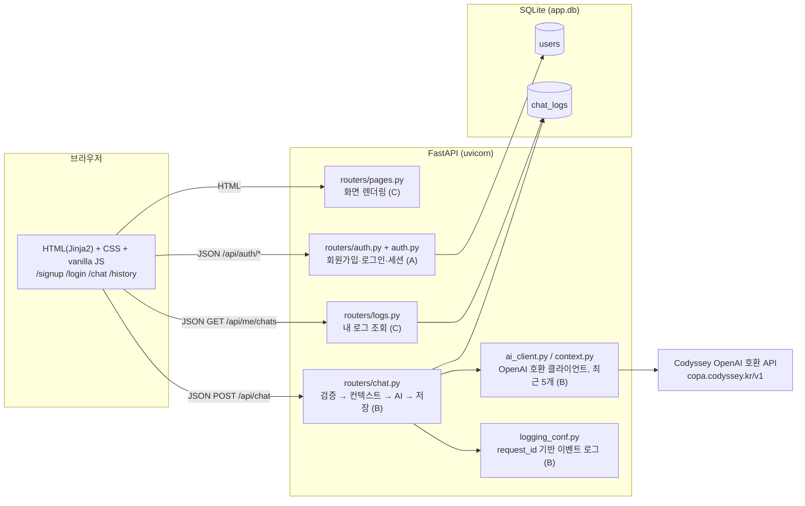
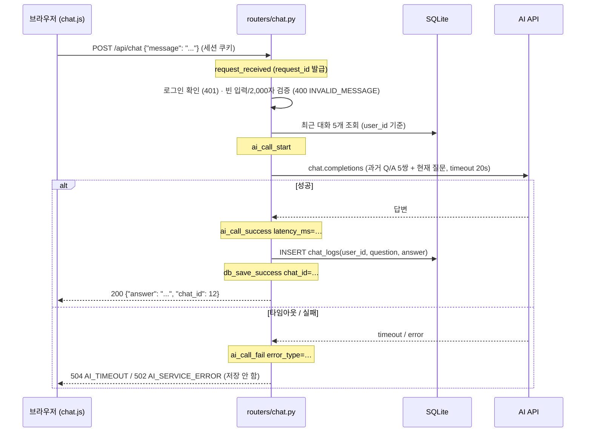
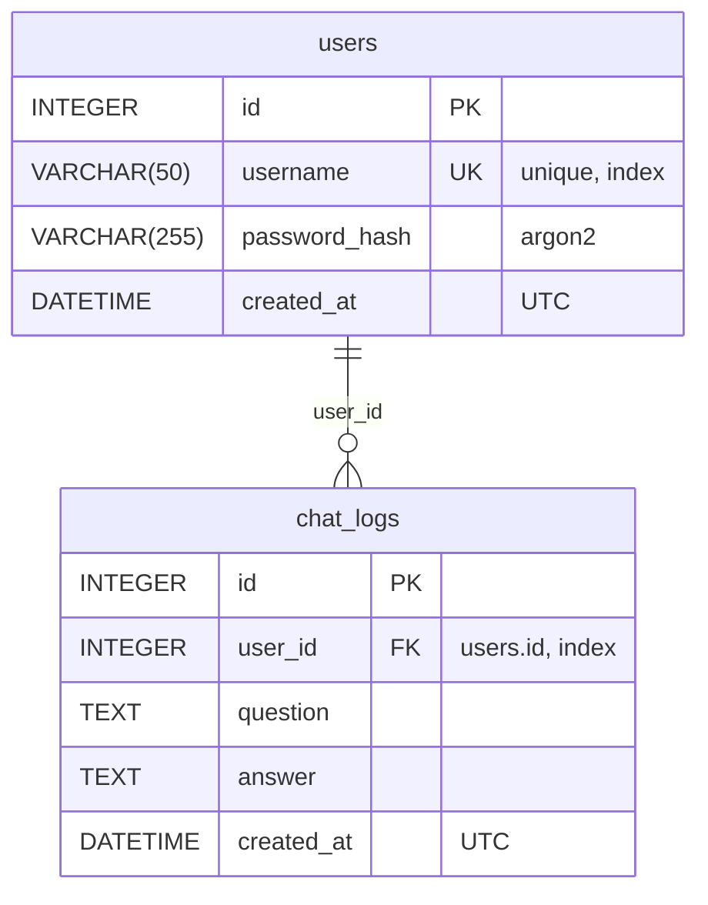

# Codyssey AI Chatbot

로그인한 사용자가 웹 화면에서 질문을 입력하면 서버가 AI API 를 호출해 답변을 돌려주고, 모든 대화를 DB 에 누적 저장해 사용자별로 조회할 수 있는 **웹 기반 AI 챗봇 서비스**입니다. Codyssey AI/SW 기초 과정 텀 프로젝트(3인 팀)로 FastAPI + SQLite 로 구현했습니다.

- **배포 URL**: _(Render 배포 후 여기에 적습니다. 예: `https://codyssey-ai-chatbot.onrender.com`)_
- **저장소**: https://github.com/Codyssey-AI-Chatbot/Codyssey-AI-Chatbot
- **기술 스택**: Python 3.10, FastAPI, SQLAlchemy 2, SQLite, Jinja2, OpenAI Python SDK(OpenAI 호환 API), pytest

## 목차

1. [프로젝트 개요](#1-프로젝트-개요)
2. [시스템 구조](#2-시스템-구조)
3. [API 명세](#3-api-명세)
4. [DB 구조](#4-db-구조)
5. [실행 방법 (로컬)](#5-실행-방법-로컬)
6. [배포 방법 (Render)](#6-배포-방법-render)
7. [환경 변수](#7-환경-변수)
8. [민감정보 관리](#8-민감정보-관리)
9. [운영: 로그, 예외 처리, 입력 검증](#9-운영-로그-예외-처리-입력-검증)
10. [DB 확인 가이드](#10-db-확인-가이드)
11. [팀 구성원 역할 및 개인별 작업 요약](#11-팀-구성원-역할-및-개인별-작업-요약)
12. [협업 규칙](#12-협업-규칙)
13. [테스트](#13-테스트)

---

## 1. 프로젝트 개요

### 문제 정의

리눅스 환경 구성, 웹 개발, 데이터베이스, AI API 연동은 각각 배웠지만 따로 떨어져 있으면 서비스가 되지 않습니다. 이 프로젝트는 네 가지를 **하나의 흐름**으로 연결합니다. 사용자의 질문이 브라우저에서 서버로 들어와 AI API 를 거쳐 답변으로 돌아오고, 그 기록이 DB 에 남아 다시 조회되는 전체 파이프라인을 팀 단위로 기획부터 배포까지 완성하는 것이 목표입니다.

### 타겟 사용자

| 사용자 | 하는 일 |
|---|---|
| 일반 사용자 | 회원가입·로그인 후 채팅 화면에서 질문하고 답변을 받는다. 자신의 대화 기록을 다시 본다. |
| 운영자 / 평가자 | 서버 로그로 요청 처리 과정을 추적하고, DB 에 쌓인 대화 로그를 API·화면·SQL 로 확인한다. |

### 핵심 시나리오

1. **가입과 로그인**: `/signup` 에서 가입 → `/login` 에서 로그인 → 세션 쿠키가 발급되어 `/chat` 으로 이동한다. 로그인하지 않으면 `/chat`, `/history` 는 `/login` 으로 보내고, `POST /api/chat` 은 `401` 을 돌려준다.
2. **질문과 답변**: 채팅 화면에서 질문을 보내면 서버가 AI API 를 호출하고, 답변이 같은 화면에 말풍선으로 추가된다. 서버는 질문·답변을 `chat_logs` 에 저장한다.
3. **문맥 유지**: 서버는 같은 사용자의 **최근 5개 대화**를 함께 AI 에 전달한다. "내가 방금 뭘 물어봤지?" 같은 질문에 이어서 답할 수 있다.
4. **실패 안내**: AI 가 20초 안에 답하지 않거나 오류를 내면 서비스는 죽지 않고 `AI_TIMEOUT` / `AI_SERVICE_ERROR` 안내를 화면에 보여 준다. 실패한 대화는 저장하지 않는다.
5. **기록 조회와 확인**: 사용자는 `/history` 화면과 `GET /api/me/chats` 로 자신의 로그만 본다. 운영자는 `scripts/check_logs.sql` 로 DB 를 직접 확인한다.

### 과제 요구사항 대응표

| # | 요구사항 | 구현 | 담당 |
|---|---|---|---|
| 1 | 웹 UI (질문 입력, 같은 화면에서 응답 확인) | `/chat` 페이지 + `chat.js` (fetch 로 호출, 말풍선 추가) | C |
| 2 | 사용자 인증 및 접근 제어 | 회원가입/로그인/로그아웃 API, 세션 쿠키, `get_current_user`(401) / `get_current_user_or_redirect`(303) | A |
| 3 | AI 챗봇 처리 (서버에서 AI 호출, 컨텍스트 전략) | `ai_client.py`(OpenAI 호환 API, 타임아웃), `context.py`(최근 5개) | B |
| 4 | 대화 로그 저장 및 조회/추적 | `ChatLog(user_id, question, answer, created_at)` 저장(B), `GET /api/me/chats`·`/history`·SQL(C) | A·B·C |
| 5 | 운영 및 유지보수 (로그/예외/입력 검증) | `request_received` → `ai_call_*` → `db_save_*` 로그, 에러 코드 응답, 빈 입력·2,000자 제한 | B |
| 6 | 배포 및 접근성 | Render Blueprint(`render.yaml`), 이 문서의 배포/환경 변수 절 | C |
| 7 | 협업 및 형상관리 | `main`/`develop`/`feature/*`, PR 템플릿, 이슈 연결, 팀원별 10회 이상 커밋 | 전원 |

---

## 2. 시스템 구조

### 아키텍처



AI API 키는 서버의 환경 변수에만 있고, 브라우저는 `/api/chat` 의 결과 텍스트만 받습니다.

### 채팅 요청 처리 흐름



### 주요 컴포넌트

| 경로 | 역할 | 담당 |
|---|---|---|
| `app/main.py` | FastAPI 앱 생성, 세션 미들웨어, 정적 파일, 라우터 등록, 시작 시 테이블 생성, `/health` | A |
| `app/config.py` | `.env` 와 환경 변수를 한 곳에서 읽는 `Settings` | A |
| `app/db.py` | SQLAlchemy 엔진·세션, SQLite 외래키 활성화, 요청당 세션을 주는 `get_db` | A |
| `app/models.py` | `User`, `ChatLog` 테이블 정의 | A |
| `app/auth.py` | argon2 비밀번호 해싱, `AuthError`, 로그인 확인 의존성 2종 | A |
| `app/routers/auth.py` | `POST /api/auth/signup`, `/login`, `/logout`, `GET /api/auth/me` | A |
| `app/ai_client.py` | 공급자 독립 `AIClient` 인터페이스와 OpenAI 호환 구현, 타임아웃·오류 변환 | B |
| `app/context.py` | 사용자의 최근 N개(기본 5) 대화를 시간순 메시지로 구성 | B |
| `app/routers/chat.py` | `POST /api/chat`: 검증 → 컨텍스트 → AI 호출 → 저장, 단계별 로그와 에러 코드 응답 | B |
| `app/logging_conf.py` | 민감정보를 제외한 `key=value` 이벤트 로그 (`app.chat` 로거) | B |
| `app/errors.py` | `AITimeoutError`, `AIServiceError` | B |
| `app/routers/pages.py` | `/`, `/signup`, `/login`, `/chat`, `/history` 템플릿 렌더링 | C |
| `app/routers/logs.py` | `GET /api/me/chats` 내 로그 조회 | C |
| `app/templates/`, `app/static/` | Jinja2 템플릿, CSS, `auth.js`(폼 전송), `chat.js`(채팅) | C |
| `scripts/check_logs.sql`, `scripts/check_logs.py` | DB 확인용 SQL 과 실행기 | C |
| `render.yaml` | Render 배포 설정 | C |
| `tests/` | `conftest.py`(A), `test_auth.py`(A), `test_chat.py`(B), `test_pages.py`·`test_logs.py`(C) | 전원 |

### 디렉터리 구조

```text
.
├── app/
│   ├── main.py            # 앱 생성, 미들웨어, 라우터 등록
│   ├── config.py          # 환경 변수
│   ├── db.py              # 엔진, 세션, Base
│   ├── models.py          # users, chat_logs
│   ├── auth.py            # 해싱, 인증 의존성
│   ├── ai_client.py       # AI 클라이언트
│   ├── context.py         # 대화 컨텍스트
│   ├── errors.py          # AI 예외
│   ├── logging_conf.py    # 이벤트 로그
│   ├── routers/
│   │   ├── auth.py        # /api/auth/*
│   │   ├── chat.py        # /api/chat
│   │   ├── logs.py        # /api/me/chats
│   │   └── pages.py       # 화면
│   ├── templates/         # base, signup, login, chat, history
│   └── static/            # style.css, auth.js, chat.js
├── scripts/
│   ├── check_logs.sql     # DB 확인용 SQL
│   └── check_logs.py      # SQL 실행기 (sqlite3 CLI 없는 환경)
├── tests/
├── docs/team-roles.md     # 역할 분담과 협업 규칙
├── .github/pull_request_template.md
├── .env.example           # 환경 변수 예시 (실제 값 없음)
├── render.yaml            # Render 배포 설정
├── requirements.txt
└── pytest.ini
```

---

## 3. API 명세

모든 API 는 JSON 을 주고받습니다. 로그인 상태는 서명된 세션 쿠키(`HttpOnly`, `SameSite=Lax`)로 유지되며, 브라우저의 `fetch` 는 같은 출처라 쿠키를 자동으로 보냅니다. 실행 중인 서버에서는 `/docs` (Swagger UI) 로도 확인할 수 있습니다.

### 엔드포인트 목록

| 구분 | 메서드·경로 | 로그인 | 설명 |
|---|---|---|---|
| 인증 | `POST /api/auth/signup` | 불필요 | 회원가입 |
| 인증 | `POST /api/auth/login` | 불필요 | 로그인, 세션 쿠키 발급 |
| 인증 | `POST /api/auth/logout` | 불필요 | 세션 삭제 |
| 인증 | `GET /api/auth/me` | 필요 | 내 정보 |
| 채팅 | `POST /api/chat` | 필요 | 질문 → AI 답변, 대화 저장 |
| 로그 | `GET /api/me/chats` | 필요 | 내 대화 로그 조회 (최신순) |
| 화면 | `GET /` | - | `/chat` 으로 리다이렉트 |
| 화면 | `GET /signup`, `GET /login` | 불필요 | 가입·로그인 페이지 |
| 화면 | `GET /chat`, `GET /history` | 필요 | 채팅, 내 대화 기록 (비로그인 시 `303 → /login`) |
| 운영 | `GET /health` | 불필요 | `{"status": "ok"}` |

### 오류 응답 형식

실패 시 모든 API 는 같은 모양으로 답합니다.

```json
{ "error": "AI_TIMEOUT", "message": "AI 응답이 지연되고 있습니다. 잠시 후 다시 시도해 주세요." }
```

| HTTP | `error` | 언제 |
|---|---|---|
| 400 | `INVALID_USERNAME` | 아이디가 영문·숫자·밑줄 3~30자가 아님 |
| 400 | `INVALID_PASSWORD` | 비밀번호가 8~128자가 아님 |
| 409 | `USERNAME_TAKEN` | 이미 있는 아이디 |
| 401 | `INVALID_CREDENTIALS` | 아이디 또는 비밀번호 불일치 (어느 쪽인지 알려주지 않음) |
| 401 | `UNAUTHORIZED` | 로그인이 필요한 API 를 비로그인으로 호출 |
| 400 | `INVALID_MESSAGE` | 빈 메시지 또는 2,000자 초과 |
| 504 | `AI_TIMEOUT` | AI API 가 `AI_TIMEOUT_SECONDS`(기본 20초) 안에 응답하지 않음 |
| 502 | `AI_SERVICE_ERROR` | AI API 연결 실패, 오류 상태 코드, 빈 응답 |
| 500 | `DB_SAVE_ERROR` | 답변은 받았지만 DB 저장 실패 (롤백 후 응답) |
| 422 | (FastAPI 기본) | 요청 본문/쿼리 형식 오류 (예: `limit=0`) |

### 요청·응답 예시

아래 예시는 로컬 서버(`http://127.0.0.1:8000`) 기준이며, `-c`/`-b cookies.txt` 로 세션 쿠키를 저장·전송합니다.

**회원가입**

```bash
curl -X POST http://127.0.0.1:8000/api/auth/signup \
  -H "Content-Type: application/json" \
  -d '{"username": "alice", "password": "correct-horse"}'
```

```json
HTTP 201
{ "id": 1, "username": "alice" }
```

**로그인** (응답 헤더에 `Set-Cookie: session=...`)

```bash
curl -c cookies.txt -X POST http://127.0.0.1:8000/api/auth/login \
  -H "Content-Type: application/json" \
  -d '{"username": "alice", "password": "correct-horse"}'
```

```json
HTTP 200
{ "id": 1, "username": "alice" }
```

**내 정보 / 로그아웃**

```bash
curl -b cookies.txt http://127.0.0.1:8000/api/auth/me          # {"id": 1, "username": "alice"}
curl -b cookies.txt -X POST http://127.0.0.1:8000/api/auth/logout   # {"status": "ok"}
```

**채팅** — 요청 `{"message": "..."}`, 성공 `{"answer": "...", "chat_id": n}`

```bash
curl -b cookies.txt -X POST http://127.0.0.1:8000/api/chat \
  -H "Content-Type: application/json" \
  -d '{"message": "FastAPI에서 세션 로그인은 어떻게 구현해?"}'
```

```json
HTTP 200
{ "answer": "FastAPI 자체에는 세션 기능이 없어서 Starlette 의 SessionMiddleware 를 ...", "chat_id": 12 }
```

실패 예시:

```json
HTTP 401  { "error": "UNAUTHORIZED",     "message": "로그인이 필요합니다." }
HTTP 400  { "error": "INVALID_MESSAGE",  "message": "메시지를 입력해 주세요." }
HTTP 504  { "error": "AI_TIMEOUT",       "message": "AI 응답이 지연되고 있습니다. 잠시 후 다시 시도해 주세요." }
HTTP 502  { "error": "AI_SERVICE_ERROR", "message": "AI 서비스에 일시적인 문제가 발생했습니다. 잠시 후 다시 시도해 주세요." }
```

**내 대화 로그 조회** — `limit`(1~100, 기본 20), `offset`(기본 0), 최신순. 다른 사용자의 로그는 조회되지 않습니다.

```bash
curl -b cookies.txt "http://127.0.0.1:8000/api/me/chats?limit=2&offset=0"
```

```json
HTTP 200
[
  {
    "id": 12,
    "question": "FastAPI에서 세션 로그인은 어떻게 구현해?",
    "answer": "FastAPI 자체에는 세션 기능이 없어서 ...",
    "created_at": "2026-10-08T07:14:33.611701+00:00"
  },
  {
    "id": 11,
    "question": "배포 방법을 알려줘",
    "answer": "Render 에 GitHub 저장소를 연결하면 ...",
    "created_at": "2026-10-08T07:10:02.120445+00:00"
  }
]
```

`created_at` 은 UTC 입니다. 화면(`/history`)에서는 한국 시각(KST, +9시간)으로 보여 줍니다.

---

## 4. DB 구조

SQLite 파일 하나(`app.db`, 경로는 `DATABASE_URL`)를 사용하며, 테이블은 앱 시작 시 `Base.metadata.create_all` 로 자동 생성됩니다.

### ERD



### 테이블 설명

**`users`** — 가입한 사용자

| 필드 | 타입 | 설명 |
|---|---|---|
| `id` | INTEGER PK | 사용자 식별자. 세션 쿠키에는 이 값만 저장된다. |
| `username` | VARCHAR(50), UNIQUE, INDEX | 로그인 아이디 (영문·숫자·밑줄 3~30자) |
| `password_hash` | VARCHAR(255) | argon2 해시. 평문 비밀번호는 저장하지 않는다. |
| `created_at` | DATETIME | 가입 시각 (UTC) |

**`chat_logs`** — 성공한 대화 1건 = 1행 (과제의 최소 추적 필드: 사용자 식별, 생성 시각, 질문, 응답)

| 필드 | 타입 | 설명 |
|---|---|---|
| `id` | INTEGER PK | 대화 식별자. `POST /api/chat` 응답의 `chat_id` |
| `user_id` | INTEGER FK → users.id, INDEX | 누구의 대화인지. 사용자 기준 조회와 컨텍스트 구성의 기준 |
| `question` | TEXT | 사용자 질문 원문 |
| `answer` | TEXT | AI 답변 원문 |
| `created_at` | DATETIME | 생성 시각 (UTC). 최신순 정렬 기준 |

### 설계 메모

- **사용자 기준 조회**: `user_id` 에 인덱스를 두고, 모든 조회(`/api/me/chats`, `/history`, 컨텍스트 구성)는 `WHERE user_id = 로그인 사용자` 로만 읽습니다. 다른 사용자의 로그가 섞일 수 없습니다.
- **실패는 저장하지 않음**: AI 호출이 실패하면 `chat_logs` 에 행을 만들지 않습니다. 실패 원인은 서버 로그(`ai_call_fail`)로 추적합니다.
- **외래키**: SQLite 는 기본적으로 외래키를 검사하지 않으므로 연결마다 `PRAGMA foreign_keys=ON` 을 켭니다 (`app/db.py`).
- **시각**: 저장은 UTC 로 통일하고, 표시할 때만 KST 로 바꿉니다. SQLite 는 시간대를 저장하지 않으므로 읽을 때 UTC 를 다시 붙입니다 (`app/routers/logs.py` 의 `as_utc`).
